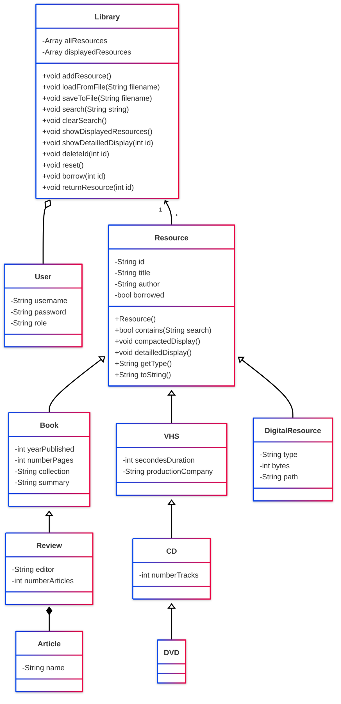
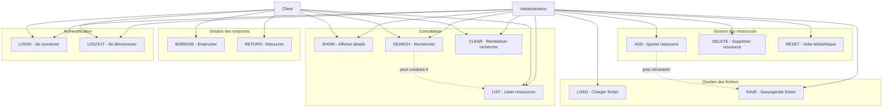
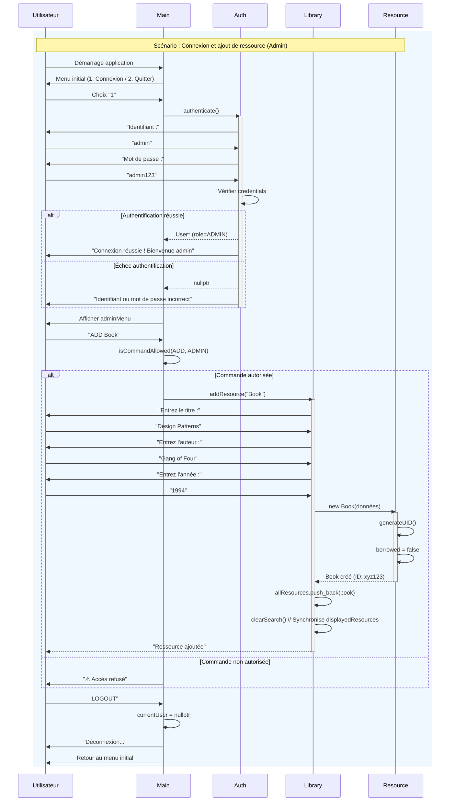
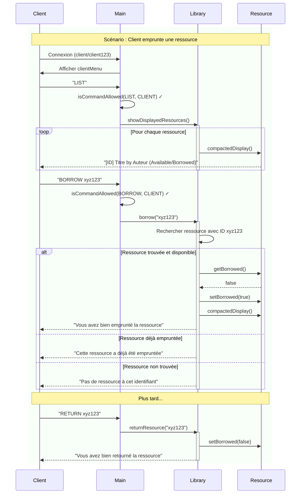
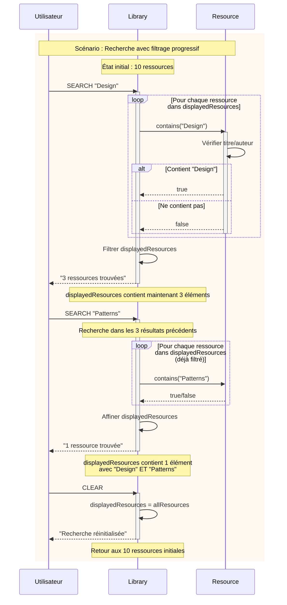

# Gestion de bibliothèque - Documentation

## Vue d'ensemble
Système de gestion de bibliothèque en **C++** avec **authentification multi-rôles** (*Administrateur* / *Client*).  
Il permet la gestion complète des **ressources physiques et numériques**.

---

## Authentification et rôles

### Comptes par défaut
- **Administrateur** : `admin / admin123`
- **Client** : `client / client123`

---

### Permissions par rôle

#### Administrateur
**Peut :**
- Ajouter des ressources (`ADD`)
- Supprimer des ressources (`DELETE`)
- Charger / Sauvegarder des fichiers (`LOAD`, `SAVE`)
- Réinitialiser la bibliothèque (`RESET`)
- Consulter et rechercher (`LIST`, `SEARCH`, `SHOW`, `CLEAR`)

**Ne peut pas :**
- Emprunter ou retourner des ressources (`BORROW`, `RETURN`)

---

#### Client
**Peut :**
- Consulter les ressources (`LIST`, `SHOW`)
- Rechercher (`SEARCH`, `CLEAR`)
- Emprunter et retourner (`BORROW`, `RETURN`)

**Ne peut pas :**
- Modifier la bibliothèque (`ADD`, `DELETE`, `RESET`)
- Gérer les fichiers (`LOAD`, `SAVE`)

---

## Commandes disponibles

### Commandes communes
- `LIST` : Afficher les ressources disponibles
- `SEARCH <chaîne>` : Rechercher dans les ressources
- `CLEAR` : Réinitialiser les résultats de recherche
- `SHOW <id>` : Afficher les détails d'une ressource
- `LOGOUT` : Se déconnecter
- `BYE` : Quitter l'application

---

### Commandes administrateur
- `ADD <type>` : Ajouter une ressource (`Book`, `CD`, `DVD`, `Review`, `DigitalResource`, `VHS`)
- `DELETE <id>` : Supprimer une ressource
- `LOAD <filename>` : Charger depuis un fichier
- `SAVE <filename>` : Sauvegarder dans un fichier
- `RESET` : Vider complètement la bibliothèque

---

### Commandes client
- `BORROW <id>` : Emprunter une ressource
- `RETURN <id>` : Retourner une ressource empruntée

---

## Types de ressources
- **Book** : Livres *(année, pages, collection, résumé)*
- **Review** : Revues *(hérite de Book + éditeur, articles)*
- **CD** : Disques audio *(durée, pistes, compagnie de production)*
- **DVD** : Disques vidéo *(hérite de CD)*
- **VHS** : Cassettes vidéo *(durée, compagnie de production)*
- **DigitalResource** : Ressources numériques *(type, taille, chemin)*


## Diagrammes UML
### Diagramme de classes


### Diagramme Usecases


### Diagramme de séquences - Authentification et ADD


### Diagramme de séquences - Emprunt et retour (Client)


### Diagramme de séquences - Recherche incrémentale


## Flux d'utilisation

### Première utilisation (Administrateur)
1. Démarrer l'application.
2. Se connecter avec les identifiants : `admin / admin123`
3. Ajouter des ressources (`Book`, `CD`, `DVD`) ou charger un fichier (exemple : `library.txt`) :
    - `ADD Book`
    - `ADD CD`
    - `LOAD library.txt`
4. Sauvegarder si nécessaire : `SAVE bibliotheque.txt`
5. Se déconnecter : `LOGOUT` ou quitter : `BYE`

---

### Utilisation par un client
1. Se connecter avec : `client / client123`
2. Consulter : `LIST`
3. Rechercher : `SEARCH <titre>`
4. Emprunter : `BORROW <id>`
5. Retourner : `RETURN <id>`

---

## Format de sauvegarde
Les ressources sont sauvegardées **ligne par ligne**, avec des **champs séparés par `;`**.
```text
Book;id;titre;auteur;0;année;pages;collection;résumé
CD;id;titre;auteur;0;durée;pistes;compagnie
Review;id;titre;auteur;0;année;pages;collection;résumé;éditeur;nbArticles;Article1,Article2
```

## Compilation et exécution
### Avec CMake 
Le projet utilise **CMake** pour la gestion de la compilation. Voici la structure :
```text
ProjetCpp/
├── CMakeLists.txt
├── src/
│   ├── main.cpp
│   ├── app/
│   │   ├── library.cpp
│   │   └── utils.cpp
│   └── models/
│       ├── Resource.cpp
│       ├── Book.cpp
│       ├── Review.cpp
│       ├── CD.cpp
│       ├── DVD.cpp
│       ├── VHS.cpp
│       ├── DigitalResource.cpp
│       └── ResourceType.cpp
└── test/
└── (fichiers de tests)
```
#### Commandes de compilation
```bash
# Créer le dossier de build
mkdir build
cd build

# Configurer le projet avec CMake
cmake ..

# Compiler
cmake --build .

# Exécuter l'application
./ProjetCpp

# Exécuter les tests
./tests
```
### Compilation manuelle
Si vous préférez compiler manuellement sans CMake :
```bash
# Compiler tous les fichiers source
g++ -std=c++20 \
    src/main.cpp \
    src/app/library.cpp \
    src/app/utils.cpp \
    src/models/Resource.cpp \
    src/models/Book.cpp \
    src/models/Review.cpp \
    src/models/CD.cpp \
    src/models/DVD.cpp \
    src/models/VHS.cpp \
    src/models/DigitalResource.cpp \
    src/models/ResourceType.cpp \
    -I./include \
    -o bibliotheque

# Exécution
./bibliotheque
```
### Prérequis
- **Compilateur** : g++ 9.0+ ou clang++ 10.0+ (support C++20)
- **CMake** : version 4.0 ou supérieure
- **Système d'exploitation** : Linux, macOS, ou Windows (avec MinGW/MSYS2)


## Améliorations futures possibles
- Interface graphique
- Support de base de données
- Logging des actions
- Hashage des mots de passe
- Persistance des utilisateurs dans un fichier
- Système d'inscription pour nouveaux clients
- Historique des emprunts par utilisateur
- Limitation du nombre d'emprunts simultanés
- Dates d'emprunt et de retour
- Système de réservation
- Pénalités pour retards