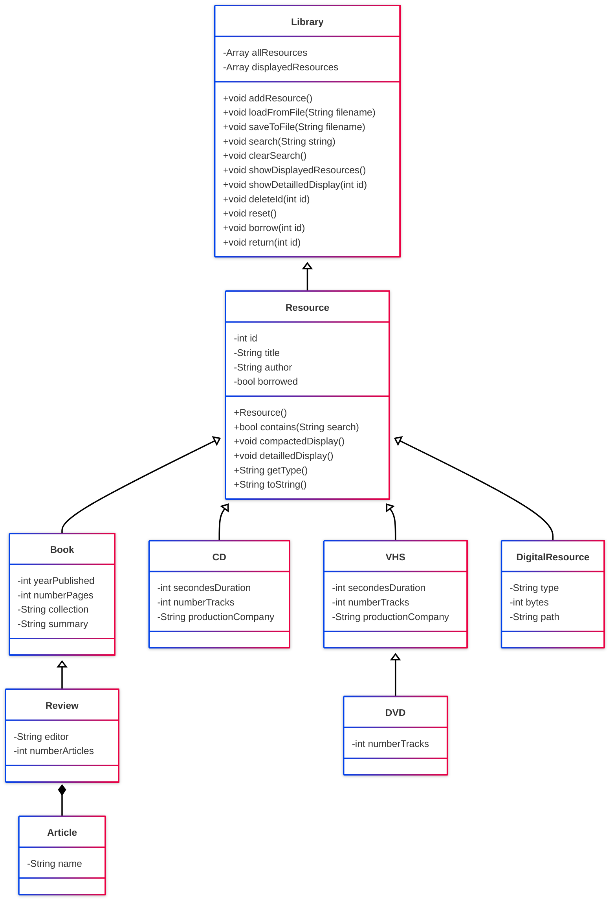

# Objectif du projet
L’objectif du projet est de mettre en œuvre les notions appréhendées durant l’enseignement
de ce module. Durant cet enseignement nous avons acquis les notions de base de la
conception/programmation orientée objets appliquées au langage C++.

# Diagramme UML
